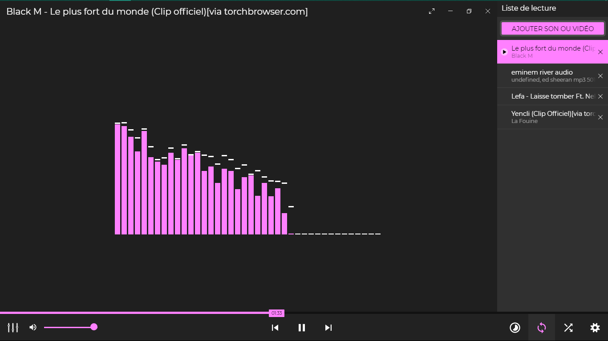
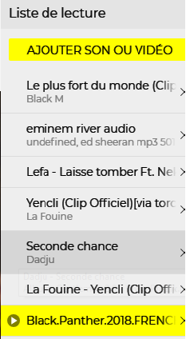

# ZIKALIZER

- [Vous pouvez tester en ligne en cliquant ici](https://ljoboy.github.io/zikalizer/)
## Auteurs: 
- [Lijerbul LJOBOY](https://fb.me/jonathan.bosemwa)

## Ressources
- Visualiseur audio (modifié): [HTML5 Audio Visualizer](https://github.com/Wayou/HTML5_Audio_Visualizer)
- Icones: [Material Design Icons](https://github.com/google/material-design-icons)

## Technologies utilisées
- Web Audio API (Visualiseur)
- HTML `<video>` balise
- CSS variables
- Canvas

## Contribué
Tirez les demandes! N'hésitez pas à parcourir [notre liste de problèmes] (https://github.com/ljoboy/zikalizer/issues) pour voir que vous pouvez contribuer [:]] (http://i.imgur.com/Bq7Gq5W. png? raw = true ":)")

## Exécuter en tant qu'application autonome
En plus d'être une application Web, vous pouvez également exécuter le lecteur multimédia Zikalizer en tant qu'application autonome à l'aide du moteur d'exécution Electron.

Pour commencer, vous aurez besoin de [NODE JS](https://nodejs.org/), [Npm](https://www.npmjs.com/) et éventuellement [git](https://git-scm.com/).

### Installer les prérequis
Téléchargez le projet (en téléchargeant le projet compressé [ici](https://github.com/ljoboy/zikalizer/archive/master.zip) ou en tapant `git clone https://github.com/ljoboy/zikalizer`)
puis exécutez la commande suivante dans le répertoire racine.
```
npm i
```

### Exécuter l'application

Si rien ne échoue, vous pouvez exécuter l'application en tapant:
```
npm start
```

### Compilé l'application:

Les exécutables apparaîtront dans `dist/`.

* Plate-forme actuelle uniquement: `npm run pack`
* Windows (32-bit et 64-bit): `npm run pack-win`
* macOS 64-bit: `npm run pack-osx`
* Linux (32-bit et 64-bit): `npm run pack-linux`
* Pour les 3 plates-formes: `npm run pack-all`

### Screenshots

Merci d'avoir lu ce readme! Voici quelques captures d'écran de l'appli autonome en récompense:



               | 
:---------------------------------------------------:|:-----------------------------------------------------:

<p align="center"></p>
