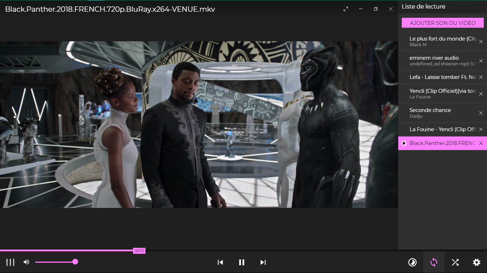

# ZIKALIZER

## Auteurs: 
- [Lijerbul LJOBOY](https://fb.me/jonathan.bosemwa)

## Ressources
- Visualiseur audio (modifié): [HTML5 Audio Visualizer](https://github.com/Wayou/HTML5_Audio_Visualizer)
- Icones: [Material Design Icons](https://github.com/google/material-design-icons)

## Technologies utilisées
- Web Audio API (Visualiseur)
- HTML `<video>` balise
- CSS variables
- Canvas

## Contribué
Tirez les demandes! N'hésitez pas à parcourir [notre liste de problèmes] (https://github.com/ljoboy/zikalizer/issues) pour voir que vous pouvez contribuer [:]] (http://i.imgur.com/Bq7Gq5W. png? raw = true ":)")

# Run as standalone app
In addition to being a web app, you can also run the Media Player as a standalone app using the Electron runtime.

To get started, you'll need NodeJS, Npm and optionally git.

### Install the Prerequisites
Download the project (by downloading the zipped project or by typing `git clone https://github.com/nt1m/media-player`)
then run the following command in the root directory.
```
npm i
```

### Run the app

If nothing fails then you can run the app by typing:
```
npm start
```

### Bundling the app:

The bundles will appear in `dist/`.

* Current platform only: `npm run pack`
* Windows (both 32-bit and 64-bit): `npm run pack-win`
* macOS 64-bit: `npm run pack-osx`
* Linux (both 32-bit and 64-bit): `npm run pack-linux`
* For all 3 platforms: `npm run pack-all`

### Screenshots

Thank you for reading this readme! Here are some screenshots of the standalone app as a reward:


               | 
:---------------------------------------------------:|:-----------------------------------------------------:

<p align="center"></p>
